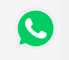
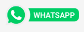

# WHATSAPP BUTTON

This component allows users write direct whatsapp messages. You can set image logo, telephone number, message and button size. The button has a fixed position on the bottom.

### Button example




### Example redirect button


## Configuration

### **Step 1** - Basic setup

Access the VTEX IO [basic setup guide](https://vtex.io/docs/getting-started/build-stores-with-store-framework/1) and follow all the given steps.

By the end of the setup, you should have the VTEX command line interface (Toolbelt) installed along with a developer workspace you can work in.

---

### **Step 2** - Cloning the repository

[Clone](https://help.github.com/en/github/creating-cloning-and-archiving-repositories/cloning-a-repository) this repository to your local files to be able to effectively start working on it.

Then, access the repository's directory using your terminal.

---

### **Step 3** - Edit manifest.json

Go to the manifest.json file and change the following values:

- Vendor
- Name
- Version (If it's different than example)
- Title
- Description

```json
{
  "vendor": "CHANGE_ME",
  "name": "CHANGE_ME",
  "version": "0.0.1",
  "title": "YOUR TITLE",
  "description": "YOUR DESCRIPTION",
  "builders": {
    "react": "3.x",
    "messages": "1.x",
    "docs": "0.x",
    "store": "0.x"
  }
}
```

---

### **Step 4** -Install dependencies

We need to access the terminal and go to `react` folder. Now we have to run `Yarn` and install all required dependencies for this component.

---

### **Step 5** - Link this repository to your current project

Then time has come to upload all the changes you made in your local files to the platform. For that, use the `vtex link` command.

If the process runs without any errors, the following message will be displayed: `Sending local change event`.

This will enable you to see the applied changes in real time, through the account and workspace in which you are working.

---

### **Step 6** - Adding the app on your project

1. Adding the app as a theme dependency in the `manifest.json` file;

```json
  "dependencies": {
    "itgloberspartnercl.whatsapp-button": "0.x"
  }
```

2. Declaring the app's main block in a given theme template or inside another block from the theme.

```json
{
  "responsive-layout.desktop#home__wp-button": {
    "title": "Whatsapp Button",
    "children": ["whatsapp-button"]
  },
  "whatsapp-button": {
    "props": {
      "logo": "assets/img/wp-icon.png",
      "phone": "777777777",
      "message": "VTEX ES LO MEJOR",
      "width": 70,
      "height": 70
    }
  }
}
```

---

### **Step 7** - Check the app is connected

By running `vtex list`, you can verify if the app is linked. On your Linked Apps you must have

```json
itgloberspartnercl.whatsapp-button             0.0.1
```

---

## Customization

`No CSS Handles are available yet for the app customization.`

<!-- DOCS-IGNORE:start -->

## Contributors ✨

Thanks goes to these wonderful people:

1. Hevert David Gelis Diaz
